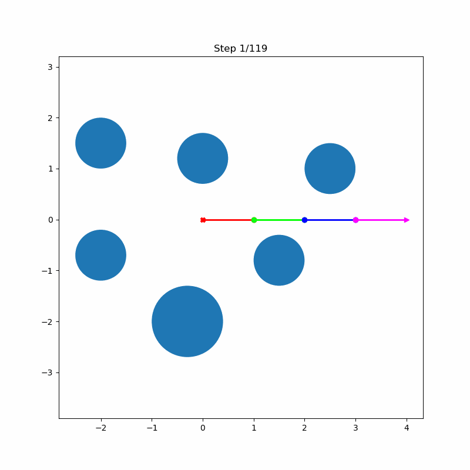

# RRT Path Planning for N-Link Manipulator

A C++ implementation of Rapidly-exploring Random Trees (RRT) algorithm for path planning of a N-link robotic manipulator in continuous 2D space with obstacle avoidance.

## Overview

This project implements a motion planning solution for a 4R manipulator (N revolute joints) operating in a 2D workspace with circular obstacles. The algorithm efficiently finds collision-free paths from start to goal configurations using the RRT approach.

## Problem Description

### Workspace
- **Domain**: Continuous 2D area W = ℝ × ℝ
- **Obstacles**: 6 circular obstacles defined by [x, y, radius]
- **Manipulator**: N-link mechanism with root joint at (0, 0)

### Configuration Space
- **State Representation**: q = [θ₁, θ₂, θ₃, θ₄]
- **Joint Angles**: θᵢ ∈ (-180°, 180°] (continuous)
- **Collision Checking**: Minimum distance threshold to obstacles

## Features

- **High-performance C++ core** with Python bindings
- **RRT algorithm** for path planning in continuous space
- **Collision detection** between manipulator links and obstacles
- **Multiple distance metrics** with configurable weights
- **Visualization tools** for states and trajectories
- **Optimized** using Eigen library for linear algebra

## Installation & Compilation

### Prerequisites
- C++17 compatible compiler
- Python 3.6+
- Eigen3 library
- pybind11
- matplotlib
- numpy

### Compiling C++ Library

```bash
# Clone and build
git clone git@github.com:oliaiaia/rrt.git
cd rrt
mkdir build && cd build
cmake ..
make

# The library will be compiled as rtt_planning_lib.*.so
```


### Configuration Parameters

- **Step Threshold**: Maximum allowed rotation per joint per step (degrees)
- **Goal Threshold**: Acceptance threshold for reaching goal (degrees)
- **Intermediate Steps**: Number of collision checks between states
- **Distance Weights**: Custom weights for each joint in distance calculation

## Algorithm Performance

### Step Size Comparison

| Step Size | Performance | Solution Quality |
|-----------|-------------|------------------|
| **10°** | Balanced | Good |
| **5°** | Slower | Precise |
| **25°** | Faster | Coarse |

### Visualization Examples


*RRT with 10° step limit - Balanced performance*


*RRT with 5° step limit - Higher precision*


*RRT with 25° step limit - Faster exploration*

## Project Structure

```
.
├── include/
│   ├── RRT.hpp          # RRT algorithm implementation
│   ├── Tree.hpp         # Tree data structure
│   └── Environment.hpp  # Environment and collision checking
├── src/
│   ├── RRT.cpp          # RRT algorithm
│   ├── Tree.cpp         # Tree operations
│   ├── bindings.cpp     # Python bindings
│   └── test.cpp         # C++ tests
├── olgatiupina_ps2.ipynb# Main Python notebook
├── environment.py       # Base Python classes for data
└── data.pickle          # Problem data
```

## Key Components

### RRT Algorithm
- **Sampling**: Smart sampling in configuration space
- **Nearest Neighbor**: L1 distance with configurable weights
- **Collision Checking**: Continuous path validation
- **Path Extraction**: Backtracking from goal to start

### Collision Detection
- Line-circle intersection tests
- Continuous path validation
- Configurable safety threshold

### Distance Metrics
```cpp
// Weighted L1 distance
distance = w1*|θ₁| + w2*|θ₂| + w3*|θ₃| + w4*|θ₄|
```

## Running the Code

1. **Compile C++ library** (as shown above)
2. **Open main.ipynb** in Jupyter notebook
3. **Execute cells** sequentially to:
   - Load problem data
   - Visualize start/goal states
   - Run RRT planning
   - Generate animations
   - Analyze results

## Customization

### Modifying Distance Weights
```python
planner.set_weights_in_distant_func(1.0, 1.0, 0.5, 0.5)  # w1, w2, w3, w4
```
